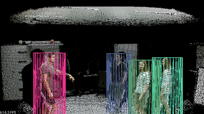

# cimat_sort_rgbd
 

A [ROS](http://wiki.ros.org/) package for tracking people in RGB-D images with [SORT](https://github.com/abewley/sort) (Simple Online and Realtime Tracking) algorithm.

Developing ...

## Dependencies
* [Ubuntu](https://ubuntu.com/) 16.04 LTS.
* [PCL](https://github.com/PointCloudLibrary/pcl) 1.7.2.
* [OpenCV](https://github.com/opencv/opencv) 3.3.1.

## Instalation
```sh
$ cd ~/catkin_ws/src
$ git clone https://github.com/CarlosLopezNubes5/cimat_sort_rgbd.git
$ cd ..
$ catkin_make
```

## pcl_people_detection
The program pcl_people_detector is the code created by [PCL](https://pcl-tutorials.readthedocs.io/en/latest/ground_based_rgbd_people_detection.html#ground-based-rgbd-people-detection) to detect people on a ground plane with RGB-D data, to test it requires having connected an rgbd sensor (e.g. Kinect, Realsense).

Execute following command:
```sh
$ rosrun cimat_sort_rgbd pcl_people_detection
```

## simulate_pcl_people_detection.
To simulate the plc detector, using an RGB-D image dataset it is necessary to download the dataset previously. For the simulation with a dataset, we make use of the EPFL-LAB dataset, [here](../master/test/pcl_people_detector/Dataset-Simulation/README.md) you can see where to download it.

You must first copy the dataset into the folder `utils/dataset/` as follows:
- First download the file `epfl_lab.tar.gz` of the link in [here](../master/test/pcl_people_detector/Dataset-Simulation/README.md)
- Then copy and paste the `epfl_lab` folder in the following path.

```sh
$ cd catkin_ws/src/cimat_sort_rgbd/utils/dataset/
```
Now you can run the following command to run the simulation with the dataset
```sh
$ rosrun cimat_sort_rgbd dataset_pcl_people_detection
```

## Sort test on RGB-D images with PCL detector.
<p align="center"></p>

To [test](../master/src/sort/sort_proofs.cpp) the SORT algorithm with EPFL-LAB dataset and PLC detector use the following command.

```sh
$ rosrun cimat_sort_rgbd sort_proofs
```
